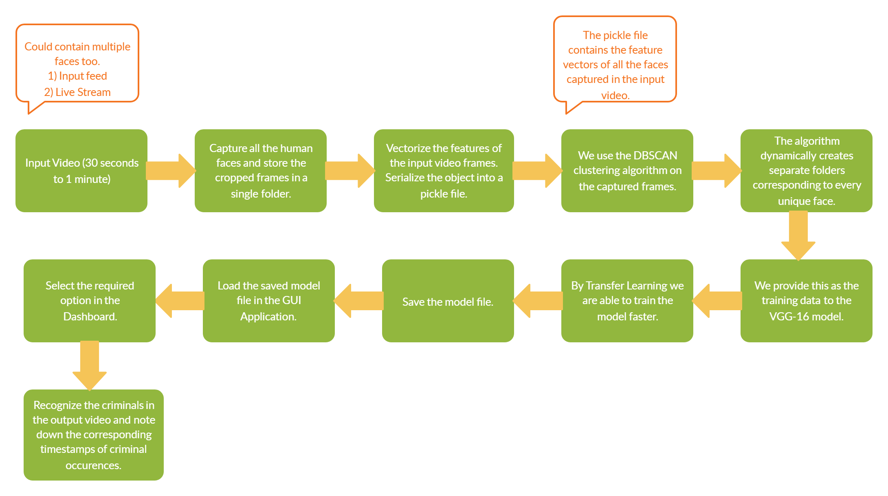

# Facial Recognition for Crime Detection

Workflow Pipeline : 

About Sapio Analytics
Sapio is a team spread across India, UK, and Silicon Valley, focused on creating high end data based algorithms powered by AI, on the path to become the first purely artificially intelligent policy making system in India and probably the world. Its on its path to become the go-to product for any government body to take decisions- the go-to product that all stakeholders (government representatives, citizens, data experts) would want the government to use before taking decisions.

<h4>Problem Statement: Build a face recognition analytics system for law enforcement agencies </h4>

<h4>Problem Description: </h4>
The security of India is becoming ever more critical in this new world. There is an expectation of a slew of organized crime activities that may attempt to cripple our law enforcement and defense agencies. In such a scenario, technology becomes of paramount importance.

One aspect of the use of technology in law enforcement is video analytics, and video analytics has various components. One of the components is to identify patterns across different videos.

The task here is to analyze a 30 second- 1 min video, and capture faces of the people in the same, and then analyze another video to see how many of the persons in the first video are seen again in the second video and at what times.

Now, if the above technology is used for thousands of videos gathered from hundreds of intelligence sources, with cross-checks across all videos, really significant information on patterns in any form of organized crime can be identified.

<h4>Allowed Tech Stack Use: </h4> 
Python OpenCV (even if you are not good in Python, we recommend you try in whatever you can).

Task 1
Analyze a 30 second- 1 min video, and capture faces of the people in the same.

Task 2
Analyze another video to see how many of the persons in the first video are seen again in the second video and at what times.

Task 3
if the above technology is used for thousands of videos gathered from hundreds of intelligence sources, with cross-checks across all videos, really significant information on patterns in any form of organized crime can be identified.

Technology/ Models used  
Performance of model  
Model selection  
Scalability  
Scalability of model  
Retrainable model  
Accessibility  
User friendly  
Accuracy  
